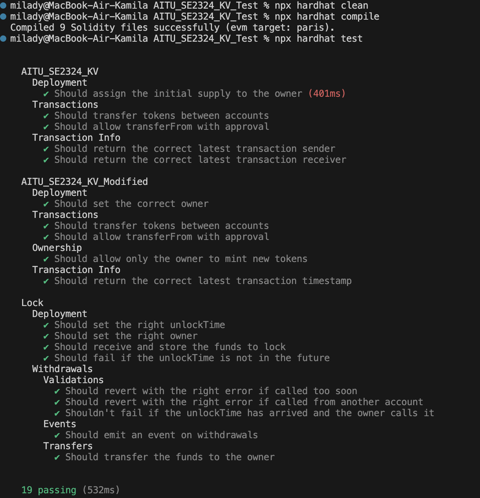

# Assignment 3. Part 2.
## 📌 Overview  
AITU_SE2324_KV is an ERC-20 smart contract designed for token transactions with built-in tracking and ownership management. The project consists of two versions:

- **AITU_SE2324_KV**: A basic ERC20 token with transaction tracking.
- **AITU_SE2324_KV_Modified**: A modified version of the token that allows minting of new tokens by the owner and includes additional transaction tracking functionalities.


## 🚀 Features  
Standard ERC-20 token implementation

Tracks transaction sender, receiver, amount, and timestamp

transfer and transferFrom functions for secure token transfers

Ownership-based minting functionality (Modified version only)

Fully tested using Hardhat with coverage for all functions

## ⚙️ Installation  
1. Clone the repository:  
   ```bash
   git clone https://github.com/gemdivk/Assignment-3.-Part-2..git
   cd Assignment-3.-Part-2.
   ```
2. Install dependencies:  
   ```bash
   npm install
   ```
3. Make sure you have Hardhat installed:
    ```bash
    npm install --save-dev hardhat

## 🚀 Usage  

### AITU_SE2324_KV

- **ERC20 Standard**: Implements the standard ERC20 functionality such as `transfer`, `approve`, and `transferFrom`.
- **Transaction Tracking**: Tracks the latest transaction (sender, receiver, amount, and timestamp).
- **Getters**:
  - `getTransactionSender()`: Returns the sender of the latest transaction.
  - `getTransactionReceiver()`: Returns the receiver of the latest transaction.
  - `getLatestTransactionTimestamp()`: Returns the timestamp of the latest transaction, formatted as a string indicating the elapsed time.

### AITU_SE2324_KV_Modified

- **ERC20 Standard**: Implements the standard ERC20 functionality as in the base contract.
- **Minting**: The contract owner can mint new tokens using the `mint()` function.
- **Transaction Tracking**: Similar to the base contract, tracks the latest transaction details.
- **Constructor Parameters**:
  - `_initialSupply`: The initial supply of the tokens.
  - `_owner`: The address of the contract owner (for minting privileges).


## Examples

### Deploying the Contract

```javascript
const { ethers } = require("hardhat");

async function deployToken() {
  const [deployer] = await ethers.getSigners();
  console.log("Deploying contracts with the account:", deployer.address);

  // Deploy AITU_SE2324_KV contract
  const Token = await ethers.getContractFactory("AITU_SE2324_KV");
  const token = await Token.deploy(1000); // 1000 is the initial supply
  console.log("AITU_SE2324_KV contract deployed to:", token.address);

  // Deploy AITU_SE2324_KV_Modified contract
  const TokenModified = await ethers.getContractFactory("AITU_SE2324_KV_Modified");
  const tokenModified = await TokenModified.deploy(1000, deployer.address); // 1000 initial supply, deployer as owner
  console.log("AITU_SE2324_KV_Modified contract deployed to:", tokenModified.address);
}

deployToken();
```

### Transferring Tokens

```javascript
const { ethers } = require("hardhat");

async function transferTokens() {
  const [owner, addr1] = await ethers.getSigners();
  const Token = await ethers.getContractFactory("AITU_SE2324_KV");
  const token = await Token.deploy(1000);

  await token.transfer(addr1.address, 100);
  console.log("Transferred 100 tokens to addr1:", addr1.address);
}
```

### Minting New Tokens (for AITU_SE2324_KV_Modified)

```javascript
const { ethers } = require("hardhat");

async function mintTokens() {
  const [owner, addr1] = await ethers.getSigners();
  const TokenModified = await ethers.getContractFactory("AITU_SE2324_KV_Modified");
  const tokenModified = await TokenModified.deploy(1000, owner.address);

  await tokenModified.mint(addr1.address, 500); // Mint 500 tokens to addr1
  console.log("Minted 500 tokens to addr1:", addr1.address);
}
```

### 🔬 Running Tests  

Execute test cases for both contract versions:  
```bash
npx hardhat clean
npx hardhat compile
npx hardhat test
```


## 🖼️ Demo Screenshots  



### Test Coverage
Initial Version (AITU_SE2324_KV)
constructor: Mints initial supply ✅
transfer(address _to, uint256 _value): Transfers tokens ✅ 
transferFrom(address _from, address _to, uint256 _value): ✅ 
getLatestTransactionTimestamp(): ✅ 
getTransactionSender(): ✅ 
getTransactionReceiver(): ✅ 
timestampToString(uint256 _timestamp): Internal function, no direct test needed
Modified Version (AITU_SE2324_KV_Modified)

constructor: Sets owner ✅ (tested)
transfer(address _to, uint256 _value): ✅ (tested)
transferFrom(address _from, address _to, uint256 _value): ✅ 
mint(address _to, uint256 _amount): ✅ (tested, but needs confirmation on error handling)
getLatestTransactionTimestamp(): ✅ 